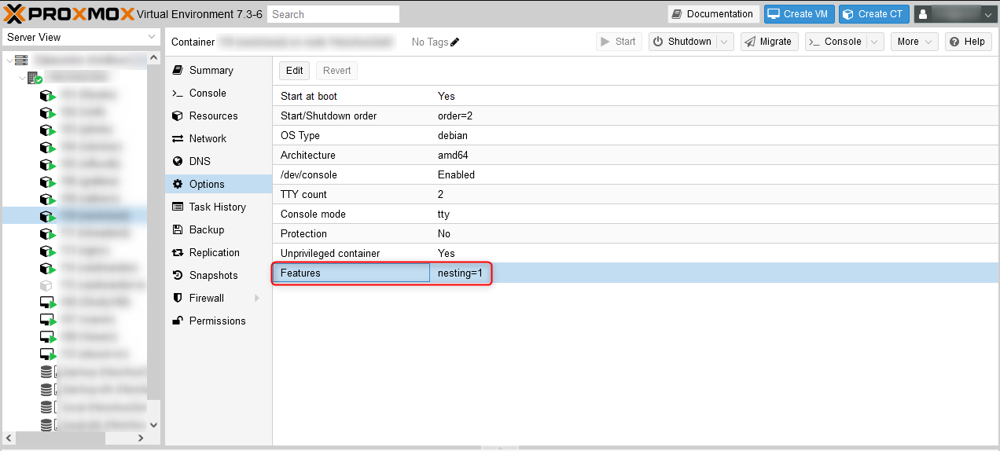

|   |   |
|---|---|
|Date| 2023/02/28|
|Tags| #Proxmox, #Debian, #LXC, #Turnkey|

# Update [Turnkey Linux LXC](https://www.turnkeylinux.org/) Debian Conatainer running on Proxmox VE from Buster to Bullseye

The recommended way of upgrading is to save your changes with tklbam, use a fresh and updated Turnkey image and reimport all your changes.
When you do not want to go this way and just update the Debian version you can follow this howto.

This will not update the Turnkey version.

## HowTo

- [Proxmox Upgrade vom 6.x to 7.x](https://pve.proxmox.com/wiki/Upgrade_from_6.x_to_7.0)
- Update current system
  - `apt update`
    - `apt upgrade`

- Update Repositories
  - `sed -i 's/buster\/updates/bullseye-security/g;s/buster/bullseye/g' /etc/apt/sources.list.d/*`

- Update repo signed keys
  - [Turnkey Forum](https://www.turnkeylinux.org/comment/51687#comment-51687)

```bash
codename=bullseye
key_dir=usr/share/keyrings
url=https://raw.githubusercontent.com/turnkeylinux/common/master/overlays/bootstrap_apt
for repo in main security; do
    full_path=$key_dir/tkl-$codename-$repo
    keyring=$full_path.gpg
    keyfile=$full_path.asc
    wget -O /$keyfile $url/$keyfile
    gpg --no-default-keyring --keyring /$keyring --import /$keyfile
    rm /$keyfile
done
```

- Update to new version
  - `apt update`
  - `apt dist-upgrade`
    - keep current configurations
  - `apt autoremove` to clean up old packages

- reboot and check services

## Troubleshooting

### Service in container is failing to start with "NAMESPACE" Error

For this container the feature `nesting` has to be enabled on the conatiner on the Proxmox host.



# [Startpage](/)
