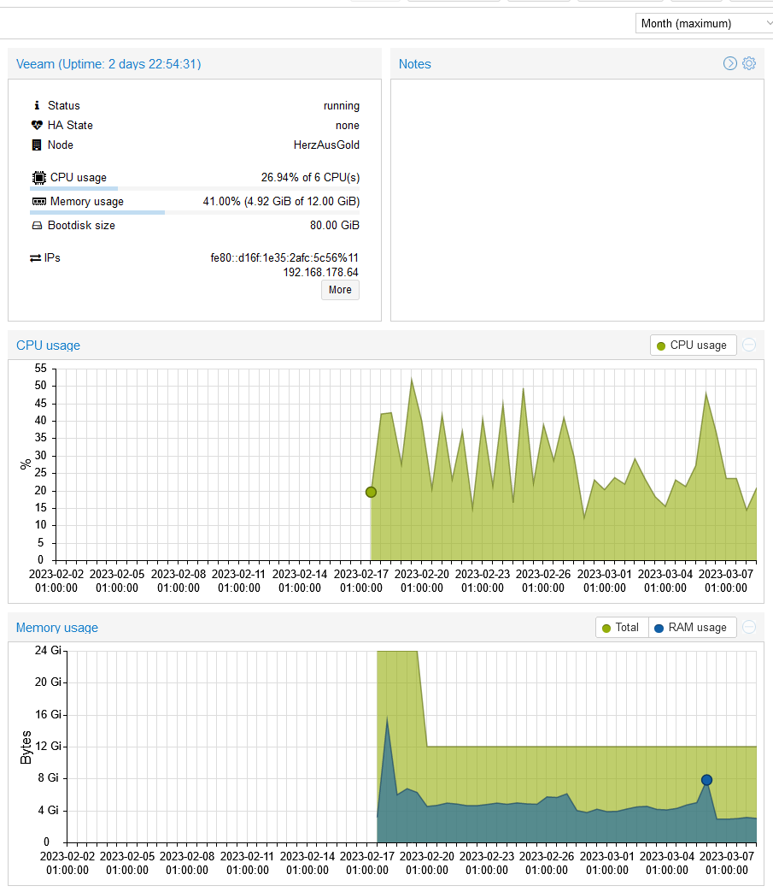

|   |   |
|---|---|
|Date| 2023/03/08|
|Tags| #Veeam|

# Finding an alternative to Acronis True Image

As longterm user user of [Acronis True Image](https://www.acronis.com) I was a bit jelous looking at [Synologys Active Backup](https://www.synology.com/dsm/feature/active-backup-business/overview).
Active Backup comes free of cost with most Synology DiskStations and you can manage everything from one Place. But, I do nat have a Diskstation nor do I plan to buy one.

Changing the pricing of Acronis from one time licensing plus some costs for updates to a yearly fee per machine and bundling it with a lot of stuff I don't need, for me was the point of searching for alternatives.

I found [Veeam Backup & Replication Community Edition](https://www.veeam.com/virtual-machine-backup-solution-free.html) which is free for small workloads.
My Goal is just to backup less then 10 windows machines.

This is indeed some enterprisa grade, scaleable solution. 
I will only focus on my home lab setup.

# HowTo install and setup

Please refer to the original documentation or [Recipe: Installing Veeam Backup & Replication All-In-One Base system](https://veeamcookbook.com/vbr/core/1BackupServer/InstallingVBR.html).

# Hardware and software requirements

For software requirement you need some windows host to let everything run.
Windows 10 or 11 Pro will be okay. No need for a server version.

For my needs it is okay to do a All-In-One install.
This means all components of the appliance will be installed into one host system.
For scaling one can setup multiple nodes of each componenent.

HowTos like [Recipe: Installing Veeam Backup & Replication All-In-One Base system](https://veeamcookbook.com/vbr/core/1BackupServer/InstallingVBR.html) refer as requirement to:
- 16 cores
- 32GB Ram
- 90GB space for the system

It is running in a virtual machine on a Gen 1 AMD Epyc for my home setup with the folowing ressources:
- 6 cores
- 12GB Ram
- 80GB space

In 3 weeks CPU usage peaked at 50% and memory usage at 8GB.



So even a bit less might be total okay.

# Troubleshooting

## CIFS / SAMBA Share fails as target
As target for the backup repository I am using a SAMBA fileshare on a BTRFS volume.

First backup failed with [Agent failed to process method {ReFs.SetFileIntegrity}](https://www.veeam.com/kb4381) error.
The suggested solution is to deactivate Virtual Synthetic Backups by adding a registry key:

```
Key Location: HKLM\SOFTWARE\Veeam\Veeam Backup and Replication\
Value Name: UseCifsVirtualSynthetic
Value Type: DWORD (32-Bit) Value
Value Data:

0 = Disable using Fast Clone with SMB Share
1 = Enable using Fast Clone with SMB Shares
```

After this the backup is working.
Disadvatage of this approach is that the creation of synthetic full backups needs to make a complete copy of all data. This can be really long lasting. When this is done on a quite slow network storage it has to read and copy simultaniously on the disks. This seems to be even slower than making a new full backup. But this would have to be transfered over the network again.

For working fast synthetic full backups we need the [fast clone](https://helpcenter.veeam.com/docs/backup/vsphere/backup_repository_block_cloning.html?ver=120) functionality on our backup target.

Luckily Samba Shares on BTRFS are supporting [FSCTL_DUPLICATE_EXTENTS_TO_FILE as server side](https://wiki.samba.org/index.php/Server-Side_Copy) copy feature by activating the bsf object per share.

```
 [share]
   path = /mnt/btrfs_fs/        # must reside within a Btrfs filesystem
   vfs objects = btrfs
```

Now after reactivating UseCifsVirtualSynthetic, Veeam is still failing with the same error missing IntegrityStreams.
At the moment I have no clue how I could enable this feature on my setup.
So we are going to [deactivate IntegrityStreams](https://forums.veeam.com/veeam-backup-replication-f2/how-do-i-disable-integrity-streams-t45258-30.html) in the regisrty and hope BTRFS file system checks ... will be sufficient.

```
Key Location: HKLM\SOFTWARE\Veeam\Veeam Backup and Replication\
Value Name: DisableRefsIntegrityStreams 
Value Type: DWORD (32-Bit) Value
Value Data:

0 = Disable using Fast Clone with SMB Share
1 = Enable using Fast Clone with SMB Shares
```

And now backups are working again.

Fast Virtual Synthetic Backups should work after the next Active Full Backup.

## Register Clients only with Deploymentpackage
I was not able to add the to be backuped clients to a Protection Group and thus the corresponding backup job from inside the Veeam Backup & Replication Console.

For me the working approach was to [create an installation package](https://veeamcookbook.com/vbr/VeeamAgents/CreateProtectionGroupsPreInstall.html) for this protection group and install it on the clients directly.

Likely directly adding clients and installing the Veeam Client from the console is only possible in an Active Directory controlled environment.
# [Startpage](/)
